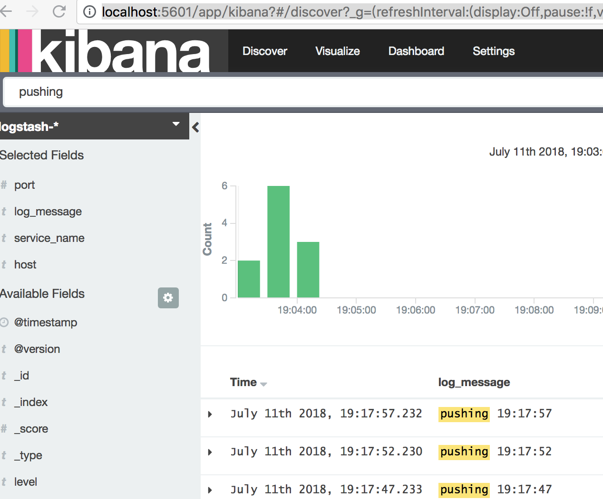

## SpringBoot1.5.2 + spring-data-elasticsearch + elasticsearch（2.2.0）
通过ElasticsearchRepository操作elasticsearch

## 版本环境说明
| 名称 | 版本 | 说明 |
| :--- | :----: | ----: |
| jdk | 1.8 |  |
|  elasticsearch    | 2.2.0      |     |
|  logstash    | 2.2.0      |     |
|  kibana    | 4.4.0      |     |
| org.elasticsearch | 2.4.4 | |
| spring-boot | 1.5.2 | |

## elk安装方法
``` sh
#下载镜像
docker pull sebp/elk:es220_l220_k440
#运行环境
docker run -d -p 5044:5044 -p 127.0.0.1:5601:5601 -p 127.0.0.1:9200:9200 -p 127.0.0.1:9300:9300  --name=elkes220_l220_k440 sebp/elk:es220_l220_k440
```

## 项目结构如下
 ``` sh
  #以下结构输出方法,输出tree到 temp.md,然后复制到README.md文本中
 tree --dirsfirst --noreport -I README.md | sed 's/^/    /' > temp.md 
 ```
    .
    ├── doc
    ├── src
    │   └── main
    │       ├── java
    │       │   └── com
    │       │       └── twl
    │       │           └── springboot
    │       │               └── es
    │       │                   ├── controller
    │       │                   │   └── APILogStashController.java #提供api查询es数据结构
    │       │                   ├── model
    │       │                   │   └── LogStashData.java #用于对应的es所存储的字段对应的实体类
    │       │                   ├── repo
    │       │                   │   └── LogStashDataRepository.java #操作es api 方法
    │       │                   ├── scheduled
    │       │                   │   └── ScheduledLogger.java  #用于计划任务产生的日志被被logstash收集
    │       │                   ├── service
    │       │                   │   ├── impl
    │       │                   │   │   └── LogStashDataServiceImpl.java #查询业务逻辑
    │       │                   │   └── LogStashDataService.java
    │       │                   └── SpringBootESLeanApplicatoin.java # app启动入口程序
    │       └── resources
    │           ├── application-dev.properties
    │           ├── application-prod.properties
    │           ├── application.properties
    │           ├── log4j.properties
    │           └── logback-spring.xml  #主要是把logger.info这种日志输出到logstash中，关键配置
    ├── pom.xml
    └── spring-boot-es.iml

### 关键依赖库
   ``` xml
        <dependency>
          <groupId>org.springframework.boot</groupId>
          <artifactId>spring-boot-starter-data-elasticsearch</artifactId>
        </dependency>
        <dependency>
          <groupId>org.springframework.boot</groupId>
          <artifactId>spring-boot-starter</artifactId>
        </dependency>
        <dependency>
          <groupId>net.logstash.logback</groupId>
          <artifactId>logstash-logback-encoder</artifactId>
          <version>4.9</version>
        </dependency>
   ```
### logback 配置说明
``` xml
<?xml version="1.0" encoding="UTF-8"?>
<configuration>
    <include resource="org/springframework/boot/logging/logback/base.xml"/>
    <logger name="org.springframework" level="INFO"/>

    <!-- Logstash-Configuration -->
    <appender name="logstash" class="net.logstash.logback.appender.LogstashTcpSocketAppender">
        <!--这里我本地的logstash收集日志的端口-->
        <destination>localhost:5044</destination>
        <encoder class="net.logstash.logback.encoder.LogstashEncoder">
            <customFields>{"service_name":"SpringBootLogger"}</customFields>
            <fieldNames>
                 <!--接收日志内容的字段名称，这里也可以用驼峰式-->
                <message>log_message</message>
            </fieldNames>
        </encoder>
        <keepAliveDuration>5 minutes</keepAliveDuration>
    </appender>

    <!--这里很重要，日志开启INFO级别，logstash只会收集INFO级别的-->
    <root level="INFO">
        <appender-ref ref="logstash" />
    </root>
</configuration>
```
### 模拟不停的收集日志，开启spring boot 自带自的任务调度工具
``` java 
         //每隔5秒种输出一下次日志
         @Scheduled(fixedRate = 5000,initialDelay = 1000)
         public void time1() {
             Date date = new Date();
             logger.info("pushing {}", dateFormat.format(date));
         }
```

## SpringBootESLeanApplicatoin 程序启动后，来看看Kibana后台

> 注意如何不能在kibana后台看到数据，请参数改连接详细配置[logstash配置](http://www.tanwenliang.com/2018/07/06/spring-boot-elk-example.html

##  用springboot查询es数据
### 关键代码
``` java
    @RequestMapping(value = "list", method = RequestMethod.POST)
    public Object count(String content) {
        //构建一个builder
        FunctionScoreQueryBuilder functionScoreQueryBuilder = QueryBuilders.functionScoreQuery()
                .add(QueryBuilders.matchPhraseQuery("log_message", "pushing"),
                        ScoreFunctionBuilders.weightFactorFunction(1000))
                .scoreMode("sum").setMinScore(10.0F);
        // 分页参数
        Pageable pageable = new PageRequest(0, 100);
        SearchQuery query = new NativeSearchQueryBuilder()
                .withPageable(pageable)
                .withQuery(functionScoreQueryBuilder).build();
        // 查数据
        Iterable<LogStashData> logStashDatas = logStashDataRepository.search(query);
        List<LogStashData> list = new ArrayList<>();
        // 取数据
        for (LogStashData logStashData : logStashDatas) {
            list.add(logStashData);
        }
        return list;
    }
```
### 测试接口效果
   ```sh 
      curl -X POST http://localhost:6666/logstash/list  
      [
          {
              "log_message": "pushing 22:00:46",
              "level": "INFO",
              "service_name": "SpringBootLogger",
              "id": "AWSEfprBluHLxa2VftV2"
          },
          {
              "log_message": "pushing 22:00:56",
              "level": "INFO",
              "service_name": "SpringBootLogger",
              "id": "AWSEfsHhluHLxa2VftV7"
          },
          {
              "log_message": "pushing 22:01:06",
              "level": "INFO",
              "service_name": "SpringBootLogger",
              "id": "AWSEfuj5luHLxa2VftV_"
          },
          {
              "log_message": "pushing 22:01:16",
              "level": "INFO",
              "service_name": "SpringBootLogger",
              "id": "AWSEfxAAluHLxa2VftWE"
          }
      ]
   ```
> 以下是通过Java spring boot 连接 es 的9300 端口查询数据所得到
> 另外还可以通过es 的http端口 9200 查询 数据

##  通过 _search  接口查询
   > http://localhost:9200/logstash-*/logs/_search 
   > curl 请求实例如下
   ``` sh 
   curl -X POST \
     http://localhost:9200/logstash-%2A/logs/_search \
     -H 'Cache-Control: no-cache' \
     -H 'Postman-Token: b73a3693-eac5-4cf0-8744-4d2c8db85190' \
     -d '{
   	"size": 10,
   	"_source":["log_message"],
   	"query": {
   	  "term": {
   	    "log_message": {
   	      "value": "pushing"
   	    }
   	  }
   	}
   }'
   # 返回结果格式如下
   {
       "took": 32,
       "timed_out": false,
       "_shards": {
           "total": 10,
           "successful": 10,
           "failed": 0
       },
       "hits": {
               "total": 1591,
               "max_score": 2.734601,
               "hits": [
                   {
                       "_index": "logstash-2018.07.10",
                       "_type": "logs",
                       "_id": "AWSEfzcvluHLxa2VftWI",
                       "_score": 2.734601,
                       "_source": {
                           "log_message": "pushing 22:01:26"
                       }
                   },
       ......
                  }
               ]
           }
       }
   ```